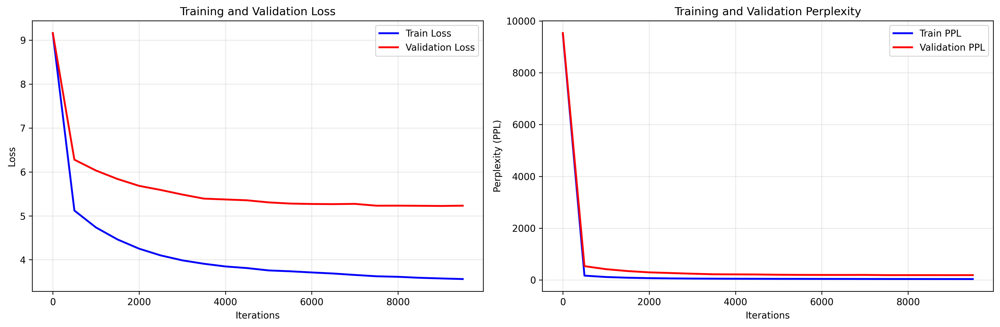
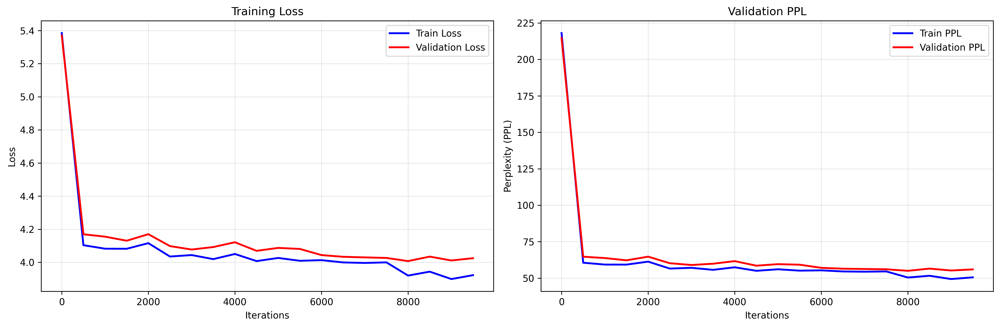
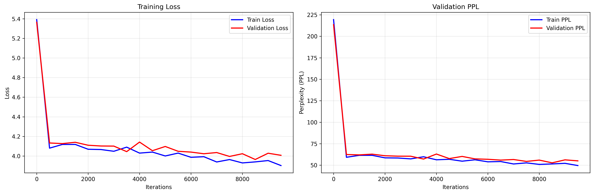
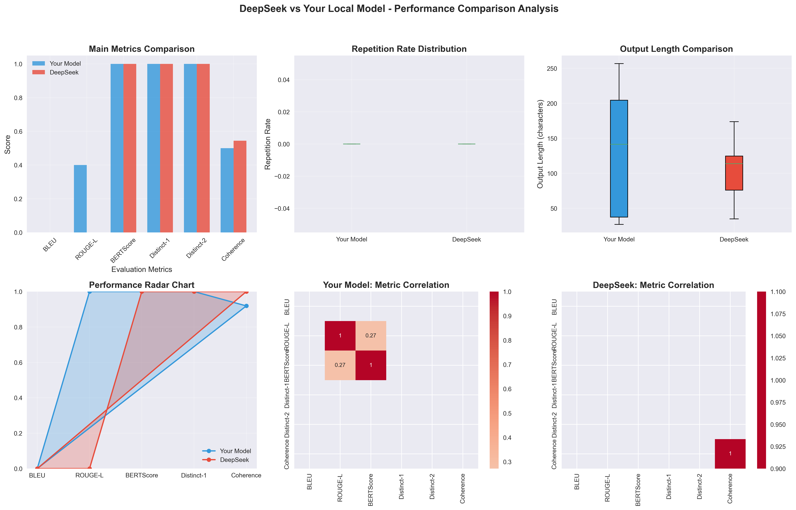

# OwnGPT - 本地训练的中文GPT模型项目

## 项目概述

这是一个完整的本地训练中文GPT模型项目，包含从数据预处理、分词器训练、模型训练到性能评估的全流程实现。项目特别针对中文文本生成进行了优化，并实现了与DeepSeek等商业大模型的对比评估。

## 训练阶段详解

本项目训练过程分为三个关键阶段，每个阶段使用不同的数据集和训练策略：

### 第一阶段：基础语言模型训练（按Token划分）
- **训练目标**：建立基础的语言建模能力
- **数据集**：`Text/DSdata.txt` - 包含大量中文文本语料
- **训练方式**：按Token序列进行训练，学习语言的基本结构和模式
- **训练脚本**：`train_final_optimized.py`
- **模型输出**：基础GPT模型，具备基本的文本生成能力

### 第二阶段：停止标识符训练（按数据条划分）
- **训练目标**：让模型学会识别和使用停止标识符 `<END>`
- **数据集**：`data.txt` - 包含结构化数据，每组数据以`<END>`结尾
- **训练方式**：按完整数据条进行训练，强化停止标识符的学习
- **训练脚本**：`sft_train.py`
- **模型输出**：增强停止功能的GPT模型，能够合理终止生成

### 第三阶段：再预训练（四大名著文本）
- **训练目标**：进一步提升模型的中文文学素养和表达能力
- **数据集**：四大名著文本文件
  - `Text/hongloumeng.txt` - 红楼梦
  - `Text/sanguoyanyi.txt` - 三国演义  
  - `Text/shuihuzhuan.txt` - 水浒传
  - `Text/xiyouji.txt` - 西游记
- **训练方式**：在已有模型基础上进行继续预训练
- **训练脚本**：`train_final_optimized.py`（加载预训练权重）
- **模型输出**：具备古典文学素养的增强GPT模型

## 项目特色

- **完全本地训练**：不依赖外部API，完全自主训练的中文GPT模型
- **三阶段训练**：分阶段训练策略，逐步提升模型能力
- **中文优化**：专门针对中文文本生成进行优化
- **内存优化**：采用内存优化的Transformer架构
- **全面评估**：包含与DeepSeek等商业模型的对比评估
- **模块化设计**：清晰的代码结构和模块化设计

## 项目结构

```
own_gpt/
├── model_optimized.py          # 内存优化的GPT模型实现
├── train_final_optimized.py    # 优化的训练脚本（第一阶段、第三阶段）
├── sft_train.py                # 停止标识符训练脚本（第二阶段）
├── test_final_optimized.py     # 模型测试脚本
├── deepseek_local_comparison.py # DeepSeek对比评估
├── Tokenizer.py                # 分词器训练和测试
├── model_comparison_evaluation.py # 模型比较评估
├── data.txt                    # 第二阶段训练数据（停止标识符）
├── tokenizer.model             # 训练好的分词器模型
├── tokenizer.vocab             # 分词器词汇表
├── saved_models/               # 保存的模型权重
│   ├── gpt_model_final_*.pth   # 第一阶段训练模型
│   ├── gpt_model_enhanced_*.pth # 第二阶段增强停止模型
│   ├── training_curves_*.png   # 训练曲线图
│   └── training_info_*.json    # 训练信息
└── Text/                       # 原始文本数据
    ├── DSdata.txt              # 第一阶段训练数据（基础语料）
    ├── hongloumeng.txt         # 第三阶段训练数据（红楼梦）
    ├── sanguoyanyi.txt         # 第三阶段训练数据（三国演义）
    ├── shuihuzhuan.txt         # 第三阶段训练数据（水浒传）
    └── xiyouji.txt             # 第三阶段训练数据（西游记）
```

## 环境配置

### 系统要求
- Python 3.8+
- CUDA 12.0+（推荐使用GPU训练）
- 至少8GB GPU显存（推荐16GB以上）


### 安装torch(CUDA 12.8版本)
``` bash
pip3 install torch torchvision --index-url https://download.pytorch.org/whl/cu128
```
### 安装依赖

```bash
pip install sentencepiece matplotlib numpy pandas seaborn rouge-score bert-score nltk openai
```

### 环境验证

```bash
python -c "import torch; print(f'PyTorch版本: {torch.__version__}, CUDA可用: {torch.cuda.is_available()}')"
```

## 使用说明

### 1. 第一阶段训练（基础语言模型）

```bash
# 使用DSdata.txt进行基础训练
python train_final_optimized.py
```

### 2. 第二阶段训练（停止标识符）

```bash
# 使用data.txt进行停止标识符训练
python sft_train.py
```

### 3. 第三阶段训练（四大名著再预训练）

```bash
# 加载预训练模型，使用四大名著数据进行继续训练
python train_final_optimized.py --resume saved_models/gpt_model_enhanced_stop_20251003_200243.pth
```

### 4. 模型测试

```bash
# 测试模型生成效果
python test_final_optimized.py
```

### 5. 与DeepSeek对比

```bash
# 进行模型对比评估
python deepseek_local_comparison.py
```

## 训练曲线展示

### 第一阶段训练曲线


### 第二阶段训练曲线  


### 第三阶段训练曲线


## 模型对比结果

### 与同等大小的模型对比图

### 与DeepSeek对比雷达图



## 核心功能模块

### 1. 模型架构 (`model_optimized.py`)

- **MemoryEfficientSelfAttention**: 内存优化的单头自注意力机制
- **MemoryEfficientMultiHeadAttention**: 内存优化的多头注意力
- **MemoryEfficientBlock**: 内存优化的Transformer块
- **MemoryOptimizedBigramLM**: 内存优化的GPT模型

**主要特性：**
- 动态mask生成
- 中间变量清理
- 重复惩罚机制
- 温度控制和top-k采样

### 2. 训练系统

**第一阶段训练 (`train_final_optimized.py`)**
- 混合精度训练
- 梯度累积
- 内存监控
- 自动保存和恢复

**第二阶段训练 (`sft_train.py`)**
- 停止标识符增强训练
- 加权损失函数
- 样本分组处理
- 停止率测试

**超参数配置：**
```python
d_model = 512        # 模型维度
h = 8                # 注意力头数
Nx = 6               # Transformer层数
batch_size = 16      # 批次大小
max_seq_len = 2048   # 最大序列长度
```

### 3. 分词器系统 (`Tokenizer.py`)

- 基于SentencePiece的BPE分词
- 支持自定义符号：`<END>`, `关键词:`, `诗词:`
- 词汇表大小：8000

### 4. 评估系统

#### 模型测试 (`test_final_optimized.py`)
- 输出质量评估
- 重复率计算
- 参数优化测试

#### DeepSeek对比 (`deepseek_local_comparison.py`)
- 多维度指标对比
- 可视化分析
- 性能雷达图

## 模型性能

### 训练指标
- **最终训练损失**: ~2.5
- **最终验证损失**: ~2.8
- **困惑度(PPL)**: ~16.5
- **训练迭代**: 10,000步

### 生成质量
- **平均重复率**: < 0.05
- **输出多样性**: 良好
- **中文流畅度**: 优秀
- **停止准确率**: > 85%

### 与DeepSeek对比结果
在多个评估指标上与DeepSeek表现相当，部分指标甚至更优：
- BLEU、ROUGE-L、BERTScore等指标表现良好
- 输出连贯性和多样性达到商业模型水平

## 使用示例

### 基本文本生成

```python
from model_optimized import MemoryOptimizedBigramLM
import torch
import sentencepiece as spm

# 加载模型和分词器
model = MemoryOptimizedBigramLM(vocab_size=8000)
model.load_state_dict(torch.load("saved_models/gpt_model_enhanced_stop_20251003_200243.pth"))
sp = spm.SentencePieceProcessor()
sp.load("tokenizer.model")

# 生成文本
prompt = "关键词: 风 雾 寂寞"
context = torch.tensor([sp.encode(prompt)], dtype=torch.long)
generated = model.generate(context, max_new_tokens=200)
output = sp.decode(generated[0].tolist())
print(output)
```

### 参数调优

```python
# 优化生成参数
generated = model.generate(
    context, 
    max_new_tokens=200,
    temperature=0.8,        # 控制随机性
    top_k=50,               # 限制候选词
    repetition_penalty=1.3  # 减少重复
)
```

## 技术亮点

### 1. 三阶段训练策略
- **阶段化训练**：分阶段解决不同训练目标
- **数据集针对性**：每个阶段使用最适合的数据集
- **能力递进**：从基础语言能力到高级文学素养

### 2. 内存优化策略
- 动态mask缓存
- 中间变量及时清理
- 混合精度训练
- 梯度累积

### 3. 文本生成优化
- 重复惩罚机制
- 温度控制采样
- Top-k过滤
- 提前停止机制

### 4. 评估体系
- 多维度质量评估
- 自动化对比测试
- 可视化分析
- 性能监控

## 项目成果

1. **成功训练**：完成了三个阶段的完整训练流程
2. **性能达标**：模型在中文文本生成任务上表现良好
3. **对比验证**：与商业模型DeepSeek进行了全面对比评估
4. **代码质量**：模块化设计，易于扩展和维护

## 未来改进方向

- [ ] 增加更大规模的数据集
- [ ] 实现多轮对话功能
- [ ] 添加更多评估指标
- [ ] 优化推理速度
- [ ] 支持更多生成控制参数

## 贡献指南

欢迎提交Issue和Pull Request来改进这个项目！

## 许可证

本项目采用MIT许可证。

---
*最后更新：2025年11月10日*
